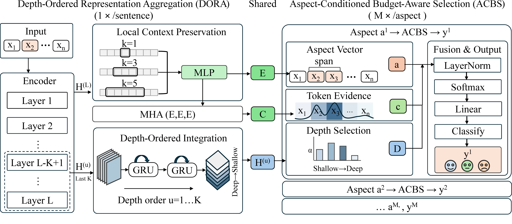

# Single-Pass, Depth-Selective Reading for Multi-Aspect Sentiment Analysis

This repository contains the official code for our ACL 2026 (main, long paper) - **Single-Pass, Depth-Selective Reading for Multi-Aspect Sentiment Analysis**
<p>
  <a href="#">
    
  </a></p>

#### (Released on April 13, 2026)

## Introduction

**DABS** is a **single-pass inference** framework for Aspect-Term Sentiment Analysis in multi-aspect sentences. It encodes each sentence once to construct a **reusable, depth-ordered substrate**, and then performs **aspect-conditioned readout** without re-encoding. The framework consists of:

- **DORA**, which constructs a shared depth substrate via a single encoder pass.
- **ACBS**, which performs **aspect-conditioned token localization** and **budget-aware depth selection**.

Experiments on four ATSA benchmarks show that DABS achieves competitive performance while reducing end-to-end computation by up to 60% in multi-aspect settings (M > 2).



## Repository Layout

```text
.
├── data/                        # benchmark data
│   └── semeval/                 # SemEval ATSA benchmarks and multilingual variants
├── figures/                     # paper figures
│   └── DABS_framework.png       # framework overview
├── outputs/                     # checkpoints and evaluation outputs
├── results/                     # batch logs and summaries
├── scripts/                     # runnable entry points
│   ├── train.py                 # single-run training and evaluation
│   ├── run_full_model_batch.py  # full-model batch runs
│   └── run_multilingual_ablation.py  # multilingual experiments
├── src/                         # source code
│   ├── config/                  # configuration and dataset recipes
│   ├── core/                    # DABS, DORA, and ACBS implementation
│   └── utils/                   # callbacks, saving, and preprocessing utilities
├── README.md                    # English README
├── README-CHINESE.md            # Chinese README
└── requirements.txt             # package versions
```

## Requirements

Install dependencies with:

```bash
pip install -r requirements.txt
```

Notes:

- Because this project was developed on an RTX 5090 GPU, some packages were early locally built versions. If exact builds are unavailable, please use approximately matching versions.
- Do **not** use `transformers` 5.x. Parts of the current codebase are not compatible with it.

## Unified Data Loading

We have integrated a unified entry point for all SemEval datasets in `src/core/data.py`, and we encourage other projects to directly reuse this loader for data access and preprocessing. The repository includes the main English SemEval ATSA benchmarks together with multilingual Restaurant-16 variants:

- `2`: `Laptop-14`
- `3`: `Restaurant-14`
- `4`: `Restaurant-15`
- `5`: `Restaurant-16`
- `6`: `Restaurant-16-FR`
- `7`: `Restaurant-16-RU`
- `8`: `Restaurant-16-ES`
- `9`: `Restaurant-16-DU`
- `10`: `Restaurant-16-TU`

The repository expects the processed JSON files under:

- `data/semeval/Laptop_14/`
- `data/semeval/Restaurant_14/`
- `data/semeval/Restaurant_15/`
- `data/semeval/Restaurant_16/`
- `data/semeval/Restaurant_16_FR/`
- `data/semeval/Restaurant_16_RU/`
- `data/semeval/Restaurant_16_ES/`
- `data/semeval/Restaurant_16_DU/`
- `data/semeval/Restaurant_16_TU/`

### Download Data from Google Drive

The `data/` directory is distributed as a compressed archive instead of being maintained directly in the GitHub repository.

- Dataset archive (`data.tar.gz`): [Google Drive](https://drive.google.com/file/d/1CV5IQRG2OtnuKcNcpbd64BlrhmIhwbkD/view?usp=sharing)

After downloading `data.tar.gz`, place it at the project root and extract it with:

```bash
tar -xzf data.tar.gz
```

This restores the expected `data/` directory used by `src/core/data.py`.

### Download Released Full-Model Checkpoints

The released full-model checkpoints are also provided as a compressed archive:

- Checkpoint archive (`full_model.tar.gz`): [Google Drive](https://drive.google.com/file/d/1JoxHMDdpiImlyRQ1Q_lokI6pQe0ukB3B/view?usp=sharing)

After downloading `full_model.tar.gz`, place it at the project root and extract it with:

```bash
tar -xzf full_model.tar.gz
```

This restores `outputs/full_model/`. You can then run batch inference over the released checkpoints with:

```bash
python scripts/run_full_model_inference.py --device cuda:0
```

## Run DABS

Single run:

```bash
DATASET_CHOICE=3 RANDOM_SEED=42 python scripts/train.py --dual-layer
```

Batch runs for the full model on the four benchmarks:

```bash
python scripts/run_full_model_batch.py --datasets 2 3 4 5 --seeds 42 123 456
```

Outputs are written to:

- `outputs/full_model/...`
- `results/full_model_batch_<timestamp>/...`

## Reuse vs Non-Reuse Comparison

To compare standard aspect-wise evaluation against the reuse path on a given checkpoint, run:

```bash
python scripts/compare_reuse_non_reuse_eval.py outputs/full_model/Restaurant-14/seed_42 --dataset-choice 3
```

You can also specify a JSON output path if you want to save the comparison report:

```bash
python scripts/compare_reuse_non_reuse_eval.py \
  outputs/full_model/Restaurant-14/seed_42 \
  --dataset-choice 3 \
  --json results/reuse_vs_non_reuse_res16_seed42.json
```

## Evaluation Protocol

These benchmarks do not provide a standard development split. Following the protocol in the paper, the best checkpoint within the training budget is selected on the test split by macro-F1.

## Citation

If you find our code useful, feel free to ⭐ star this repo!

If you use our work in your research, please cite:

```bibtex
@inproceedings{XiaACL2026,
  title={Single-Pass, Depth-Selective Reading for Multi-Aspect Sentiment Analysis},
  author={Xia, Yan and Pan, Zhuangzhuang and Kamsim, Amirrudin and Chan, Chee Seng},
  booktitle={Proceedings of the 64th Annual Meeting of the Association for Computational Linguistics (ACL)},
  year={2026}
}
```
