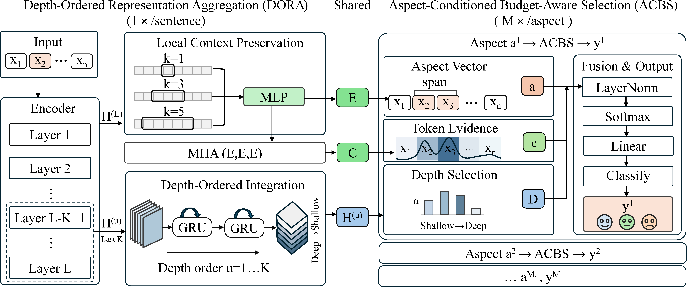

# Single-Pass, Depth-Selective Reading for Multi-Aspect Sentiment Analysis (Official Site)

**🎤 [ACL Conference Release](#acl-conference-release)**

**🎓 [Journal Extension](#journal-extension)**

<a id="acl-conference-release"></a>

## 🎤 ACL Conference Release

This repository contains the official code for our ACL 2026 (main conference,
long paper, oral presentation) paper—**Single-Pass, Depth-Selective Reading for
Multi-Aspect Sentiment Analysis**.

<p>
  <a href="https://aclanthology.org/2026.acl-long.667/" target="_blank">
    
  </a>
</p>

##### Updated on August 1, 2026 (Journal-extension code added.)

##### Updated on June 18, 2026 (ACL paper uploaded.)

##### Released on April 13, 2026

<p align="center">
  
</p>

## ACL DABS

**DABS** is a **single-pass inference** framework for Aspect-Term Sentiment Analysis in multi-aspect sentences. It encodes each sentence once to construct a **reusable, depth-ordered substrate**, and then performs **aspect-conditioned readout** without re-encoding. The framework consists of:

- **DORA**, which constructs a shared depth substrate via a single encoder pass.
- **ACBS**, which performs **aspect-conditioned token localization** and **budget-aware depth selection**.

Experiments on four ATSA benchmarks show that DABS achieves competitive performance while reducing end-to-end computation by up to 60% in multi-aspect settings (M > 2).

## Repository Layout

```text
.
├── data/                           # ACL ATSA data restored from data.tar.gz
│   └── semeval/                    # English and multilingual SemEval data
├── figures/                        # ACL paper figures
├── scripts/                        # ACL training, inference, and analysis entry points
├── src/                            # ACL DABS/DORA/ACBS implementation
│   ├── config/
│   ├── core/
│   └── utils/
├── journal/                        # isolated journal-extension code
│   ├── configs/                    # ASTE, multilingual ASTE, and ASQP protocols
│   ├── dabs_structured/            # Full DORA--QCBS structured model
│   │   ├── aste/                   # ASTE data, batching, and exact decoding
│   │   └── asqp/                   # ASQP data, batching, and exact decoding
│   ├── data/README.md              # official data sources and setup commands
│   ├── train_aste.py
│   ├── evaluate_aste.py
│   ├── train_asqp.py
│   ├── evaluate_asqp.py
│   └── requirements.txt            # separate journal environment
├── outputs/                        # generated checkpoints (git-ignored)
├── results/                        # generated summaries (git-ignored)
├── README.md
└── requirements.txt                # ACL environment
```

## ACL Requirements

Install dependencies with:

```bash
pip install -r requirements.txt
```

Notes:

- Because this project was developed on an RTX 5090 GPU, some packages were early locally built versions. If exact builds are unavailable, please use approximately matching versions.
- Do **not** use `transformers` 5.x for the ACL code. Use the separate journal environment described below for the extension.

## ACL Unified Data Loading

This section applies to the ACL conference implementation. The journal
extension uses independent ASTE/ASQP readers and data roots documented under
[Journal Data and Official Downloads](#journal-data-and-official-downloads).
We provide a unified entry point for all SemEval datasets in `src/core/data.py`.
It covers the main English SemEval ATSA benchmarks together with multilingual
Restaurant-16 variants:

- `2`: `Laptop-14`
- `3`: `Restaurant-14`
- `4`: `Restaurant-15`
- `5`: `Restaurant-16`
- `6`: `Restaurant-16-FR`
- `7`: `Restaurant-16-RU`
- `8`: `Restaurant-16-ES`
- `9`: `Restaurant-16-DU`
- `10`: `Restaurant-16-TU`

The repository expects the processed JSON files under:

- `data/semeval/Laptop_14/`
- `data/semeval/Restaurant_14/`
- `data/semeval/Restaurant_15/`
- `data/semeval/Restaurant_16/`
- `data/semeval/Restaurant_16_FR/`
- `data/semeval/Restaurant_16_RU/`
- `data/semeval/Restaurant_16_ES/`
- `data/semeval/Restaurant_16_DU/`
- `data/semeval/Restaurant_16_TU/`

### Download Data from Google Drive

The `data/` directory is distributed as a compressed archive instead of being maintained directly in the GitHub repository.

- Dataset archive (`data.tar.gz`): [Google Drive](https://drive.google.com/file/d/1CV5IQRG2OtnuKcNcpbd64BlrhmIhwbkD/view?usp=sharing)

After downloading `data.tar.gz`, place it at the project root and extract it with:

```bash
tar -xzf data.tar.gz
```

This restores the expected `data/` directory used by `src/core/data.py`.

### Download Released Full-Model Checkpoints

The released full-model checkpoints are also provided as a compressed archive:

- Checkpoint archive (`full_model.tar.gz`): [Google Drive](https://drive.google.com/file/d/1JoxHMDdpiImlyRQ1Q_lokI6pQe0ukB3B/view?usp=sharing)

After downloading `full_model.tar.gz`, place it at the project root and extract it with:

```bash
tar -xzf full_model.tar.gz
```

This restores `outputs/full_model/`. You can then run batch inference over the released checkpoints with:

```bash
python scripts/run_full_model_inference.py --device cuda:0
```

## Run ACL DABS

Single run:

```bash
DATASET_CHOICE=3 RANDOM_SEED=42 python scripts/train.py --dual-layer
```

Batch runs for the full model on the four benchmarks:

```bash
python scripts/run_full_model_batch.py --datasets 2 3 4 5 --seeds 42 123 456
```

Outputs are written to:

- `outputs/full_model/...`
- `results/full_model_batch_<timestamp>/...`

## Reuse vs Non-Reuse Comparison

To compare standard aspect-wise evaluation against the reuse path on a given checkpoint, run:

```bash
python scripts/compare_reuse_non_reuse_eval.py outputs/full_model/Restaurant-14/seed_42 --dataset-choice 3
```

You can also specify a JSON output path if you want to save the comparison report:

```bash
python scripts/compare_reuse_non_reuse_eval.py \
  outputs/full_model/Restaurant-14/seed_42 \
  --dataset-choice 3 \
  --json results/reuse_vs_non_reuse_res16_seed42.json
```

## ACL Evaluation Protocol

These benchmarks do not provide a standard development split. Following the protocol in the paper, the best checkpoint within the training budget is selected on the test split by macro-F1.

---

<a id="journal-extension"></a>

# 🎓 Journal Extension

The journal extension studies whether the same single-encoder, reusable DABS
principle transfers from supplied-aspect ATSA to latent structured affective
extraction. It supports English ASTE, multilingual ASTE, and ASQP through one
Full DORA--QCBS implementation. The extension is isolated under [`journal/`](journal/README.md):
it does not import or modify the ACL `src/` and `scripts/` implementation.

## Journal Environment

Use a separate environment because the journal implementation has a newer
software stack:

```bash
python -m venv journal/.venv
source journal/.venv/bin/activate
pip install -r journal/requirements.txt
```

## Journal Data and Official Downloads

The journal datasets are not redistributed here. Obtain them from their
upstream releases and place them under `journal/data/`:

| Task | Datasets used here | Upstream release |
|---|---|---|
| English ASTE | `14lap`, `14res`, `15res`, `16res` | [SemEval-Triplet-data / ASTE-Data-V2-EMNLP2020](https://github.com/xuuuluuu/SemEval-Triplet-data/tree/master/ASTE-Data-V2-EMNLP2020) |
| Polish ASTE | `pl_hotels`, fold 1 | [Polish-ASTE-Datasets](https://github.com/NaIwo/Polish-ASTE-Datasets) |
| Catalan/Basque ASTE | `ca`, `eu` | [ASTE-Transformer multilingual conversions](https://github.com/NaIwo/ASTE-Transformer/tree/main/dataset/data/multib) |
| ASQP | `rest15`, `rest16` | [ABSA-QUAD](https://github.com/IsakZhang/ABSA-QUAD/tree/master/data) |

Ready-to-run clone and copy commands, including the Polish fold mapping
`valid.txt` to `dev.txt`, are provided in
[`journal/data/README.md`](journal/data/README.md). Please follow the licences
and terms of the respective upstream datasets.

## Run the Journal Extension

English ASTE:

```bash
python -m journal.train_aste \
  --config journal/configs/aste_en.json \
  --dataset 16res \
  --seed 42
```

Multilingual ASTE uses the same trainer with mDeBERTa:

```bash
python -m journal.train_aste \
  --config journal/configs/aste_multilingual.json \
  --dataset ca \
  --seed 42
```

ASQP:

```bash
python -m journal.train_asqp \
  --config journal/configs/asqp.json \
  --dataset rest16 \
  --seed 42
```

See [`journal/README.md`](journal/README.md) for evaluation commands, the five
fixed seeds, output locations, and smoke checks.

## Citation

If you find our code useful, feel free to ⭐ star this repository. If you use
the ACL work in your research, please cite:

```bibtex
@inproceedings{xia2026single,
  title={Single-Pass, Depth-Selective Reading for Multi-Aspect Sentiment Analysis},
  author={Xia, Yan and Pan, Zhuangzhuang and Kamsin, Amirrudin and Chan, Chee Seng},
  booktitle={Proceedings of the 64th Annual Meeting of the Association for Computational Linguistics (Volume 1: Long Papers)},
  pages={14638--14656},
  year={2026},
  doi={10.18653/v1/2026.acl-long.667},
  url={https://aclanthology.org/2026.acl-long.667/}
}
```
